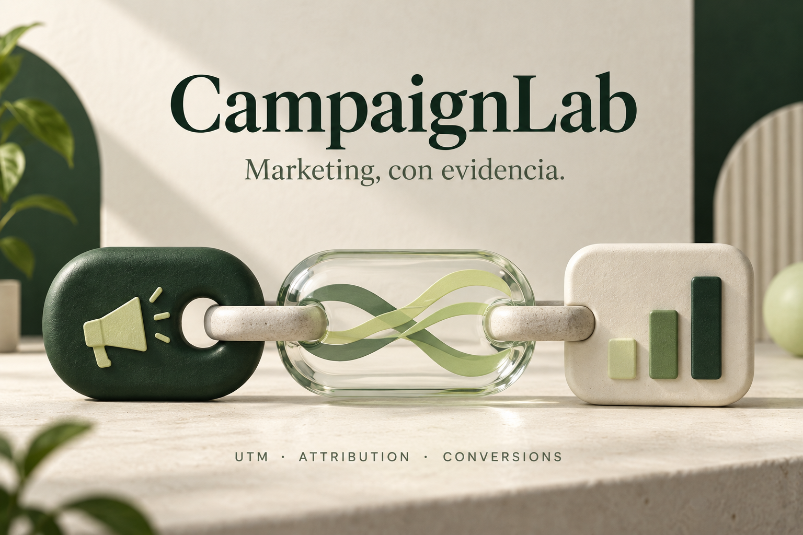
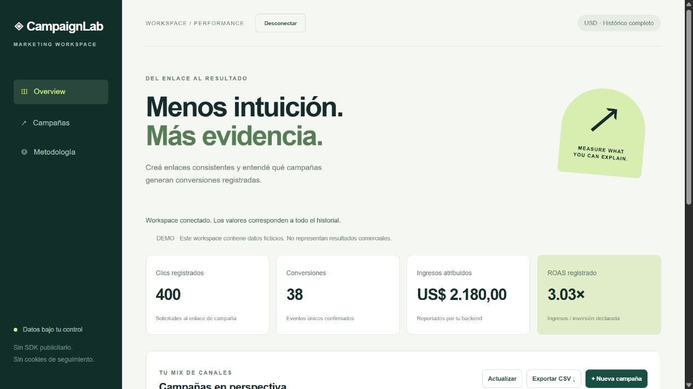

# CampaignLab

**[Abrir la demo online →](https://campaignlab-demo.pages.dev/)**

https://campaignlab-demo.pages.dev/

Sin instalación ni registro. Alojada en Cloudflare Pages con datos ficticios y simulación en el navegador. No se conecta a la computadora del autor.

Un proyecto fullstack que conecta marketing y backend: creá enlaces UTM, registrá conversiones y compará campañas con métricas explícitas.

## Probá la demo pública

Creá una campaña de ejemplo, copiá sus UTM, simulá un clic y una conversión, y reenviá el mismo evento para comprobar que no se duplican los ingresos. También podés exportar CSV y reiniciar los datos. Tus cambios se guardan únicamente en tu navegador.

La demo no registra visitas reales ni utiliza la API de Python. [Cómo funciona la demo](docs/public-demo.md).

## Qué incluye el backend del repositorio

1. Crear una campaña con destino HTTPS, source, medium, campaign e inversión manual en USD.
2. Compartir su enlace de seguimiento. Cada visita registra un clic y entrega un identificador al destino.
3. Enviar conversiones desde tu backend con una clave independiente.
4. Comparar clics, eventos, ingresos atribuidos y ROAS, y exportar CSV.

La tasa representa clics con conversión / clics totales. No equivale a personas únicas. Reenviar un evento no duplica ingresos. La ventana de atribución es de 30 días y los totales son históricos.

[Instalación](docs/setup.md) · [Arquitectura](docs/architecture.md) · [Definiciones y límites](docs/metrics.md) · [Pruebas](docs/verification.md)

La demo usa datos ficticios. No incluye integraciones con plataformas publicitarias, cuentas múltiples, atribución multicanal, devoluciones ni cálculo de ganancias. Los gráficos editoriales no representan resultados comerciales.

## Preview / Vista previa

[Mobile screenshot](assets/mobile.png). These are application screenshots, not business results.
