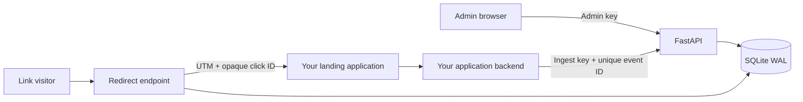

# Architecture

**[Open the public browser demo →](https://diegogutierrez.pages.dev/campaignlab/)** — fictional campaigns, simulated clicks and conversions, no installation or backend connection. The technical guides below describe the complete local backend. [Public demo scope](https://github.com/DimaGutierrez/campaignlab/blob/main/docs/public-demo.md).

The browser is plain JavaScript with semantic HTML and responsive CSS. This avoids a build toolchain for a small dashboard. The backend owns validation, persistent data and metric definitions. SQLite is deliberately scoped to a modest, single-instance workspace.

Campaigns contain a fixed manually declared spend in cents. Clicks reference campaigns. Conversions reference clicks and use a globally unique event ID. Conversion writes acquire `BEGIN IMMEDIATE`, check for an existing payload, and insert in the same transaction. The primary key is the final uniqueness constraint. Concurrent retries are tested with independent HTTP calls. SQLite serializes writers; this is not a scale benchmark.

Redirects generate unpredictable click IDs and commit before redirecting. Existing unrelated destination parameters and fragments are preserved; owned UTM parameters are replaced. Requests do not trigger server-side URL fetching.

Admin and ingestion keys are separated. Browser admin credentials stay in memory until reload/disconnect. No CORS permissions are enabled; API keys are sent in custom headers, not cookies. The application database contains no IP, user-agent or email fields. An opaque click ID still travels to the destination; infrastructure logs and privacy responsibilities must be assessed separately.

The dashboard uses `textContent` for data values. CSV cells that could start spreadsheet formulas are prefixed with an apostrophe. A restrictive Content Security Policy and no-store API headers are included. Add edge request size/rate limits before public hosting.

The initial schema is created idempotently at startup. There is no schema migration framework in v0.1. Future schema changes must include explicit versioned migrations; do not assume CREATE TABLE IF NOT EXISTS upgrades existing databases.
